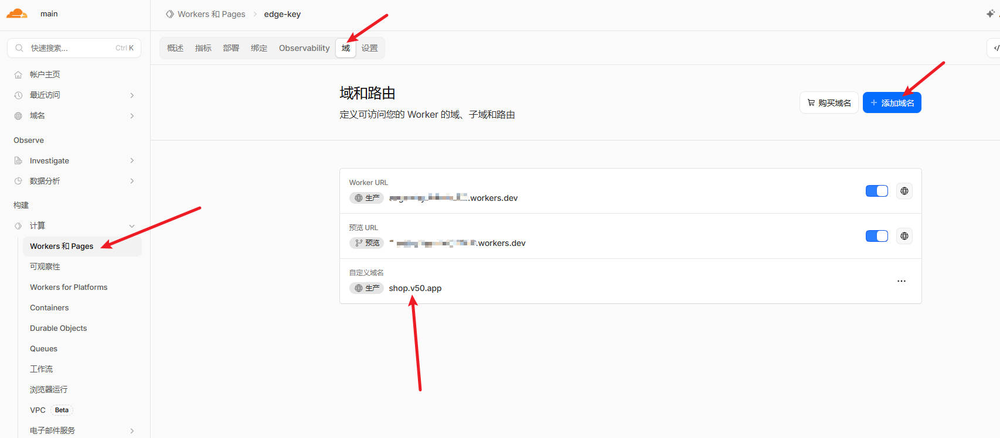
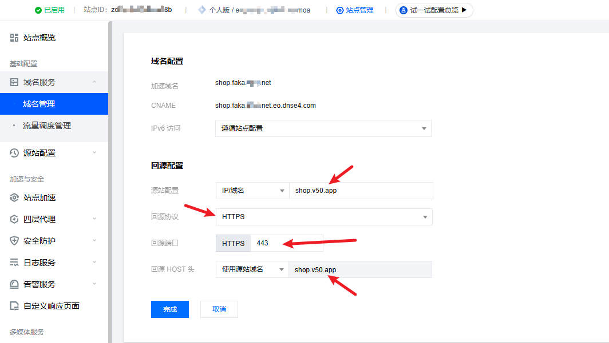
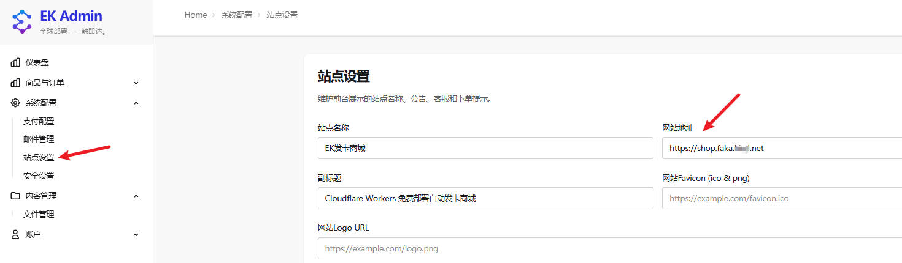

# CDN 加速配置指南

本文档介绍如何通过 CDN（如腾讯云 EdgeOne）为你的 EdgeKey 站点配置域名加速，同时解决后台登录被重定向到源站域名的问题。

## 概述

EdgeKey 部署后会默认分配一个 `xxx.workers.dev` 域名，但由于以下原因，建议绑定自己的域名并通过 CDN 加速：

- **安全限制**：Cloudflare有网关保护，直接反代workers.dev会被安全策略拦截，最终导致 http 错误
- **访问问题**：`workers.dev` 域名在国内可能无法访问
- **加速需求**：`workers.dev` 域名无法配置国内 CDN 加速，访问速度受限


因此，推荐的架构是：

```
用户访问 → CDN 加速域名（shop.faka.xxx.net）→ 源站域名（shop.v50.app）→ Cloudflare Worker
```

**注意事项**：由于 CDN 回源时会修改 `Host` 头，可能导致后台登录时被重定向到源站域名（如 `shop.v50.app`）而不是你的加速域名（如 `shop.faka.xxx.net`）。本文档将指导你完成配置并解决此问题。

本文档将指导你完成以下配置：

1. 在 Cloudflare Workers 上添加自定义域名（作为源站）
2. 在 CDN 服务商（如腾讯云 EdgeOne）配置域名加速和回源
3. 在 EdgeKey 后台配置正确的网站地址

## 前置条件

- 已部署 EdgeKey 到 Cloudflare Workers
- 拥有一个已解析的域名（如 `faka.xxx.net`）
- 拥有 CDN 服务商账号（如腾讯云 EdgeOne）
- 国内加速需要实名、域名需要备案

## 配置步骤

### 第一步：Cloudflare Workers 添加自定义域名

首先，需要在 Cloudflare Workers 上添加一个自定义域名作为源站域名。

1. 登录 [Cloudflare Dashboard](https://dash.cloudflare.com/)
2. 进入 **Workers 和 Pages** → 选择你的 Worker（如 `edge-key`）
3. 点击 **域** 选项卡
4. 在 **域和路由** 部分，点击 **添加域名**
5. 输入你的源站域名（如 `shop.v50.app`）
6. 按照提示完成域名验证和添加



添加完成后，你会看到：
- Worker URL：`xxx.workers.dev`
- 自定义域名：`shop.v50.app`（你的源站域名）

### 第二步：配置 CDN 加速（以腾讯云 EdgeOne 为例）

接下来，在 CDN 服务商配置加速域名和回源设置。

1. 登录 [腾讯云 EdgeOne 控制台](https://console.cloud.tencent.com/edgeone)
2. 进入 **域名管理**
3. 添加你的加速域名（如 `shop.faka.xxx.net`）
4. 配置 **回源设置**：

| 配置项 | 值 |
|--------|-----|
| 源站配置 | IP/域名 |
| 源站地址 | `shop.v50.app`（你的 CF Workers 自定义域名） |
| 回源协议 | HTTPS |
| 回源端口 | 443 |
| 回源 HOST 头 | 使用源站域名 `shop.v50.app` |



5. 点击 **完成** 保存配置

### 第三步：EdgeKey 后台配置网站地址

最后，在 EdgeKey 后台配置正确的网站地址，确保后台登录重定向到加速域名。

1. 登录 EdgeKey 后台（如 `https://shop.faka.xxx.net/admin`）
2. 进入 **系统配置** → **站点设置**
3. 在 **网站地址** 字段，输入你的加速域名：`https://shop.faka.xxx.net`
4. 保存设置



## 验证配置

配置完成后，进行以下验证：

1. **前台访问**：通过加速域名访问站点，确认页面正常加载
2. **后台登录**：访问后台登录页面（`https://shop.faka.xxx.net/admin/login`），输入账号密码登录
3. **确认重定向**：登录成功后，确认页面停留在 `shop.faka.xxx.net` 域名，没有被重定向到 `shop.v50.app`

## 常见问题

### Q1: 登录后被重定向到源站域名怎么办？

**原因**：EdgeKey 后台的「网站地址」未配置或配置错误。

**解决方案**：确保在 **系统配置** → **站点设置** → **网站地址** 中填写了正确的加速域名（如 `https://shop.faka.xxx.net`）。

### Q2: 前台页面无法访问怎么办？

**可能原因**：
- CDN 域名解析未生效
- 源站地址配置错误
- 回源协议不匹配

**解决方案**：
1. 检查 CDN 域名解析是否生效（使用 `ping` 或 `nslookup` 命令）
2. 确认源站地址正确（应为 CF Workers 的自定义域名）
3. 确认回源协议为 HTTPS，端口为 443

### Q3: 为什么回源 HOST 头要设置为源站域名？

Cloudflare Workers 需要通过 `Host` 头识别请求的目标 Worker。如果回源 HOST 头设置为加速域名，Cloudflare 可能无法正确路由请求到你的 Worker，导致 404 错误。

### Q4: 可以使用其他 CDN 服务商吗？

可以。本文以腾讯云 EdgeOne 为例，但同样适用于其他 CDN 服务商（如阿里云 ESA）。关键配置点是：
- 源站地址指向 CF Workers 自定义域名
- 回源协议为 HTTPS
- 回源 HOST 头设置为源站域名

## 相关文档

- [一键部署教程](../fast_deploy/start.md)
- [支付配置](../pay/)
