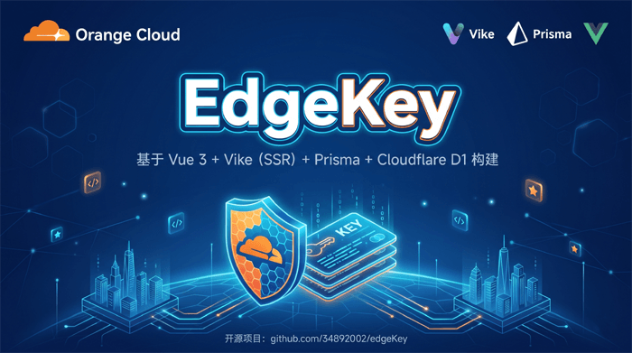
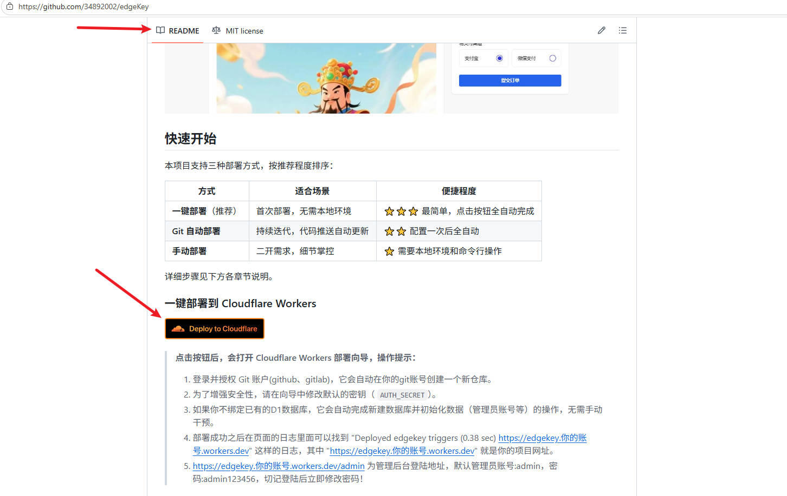
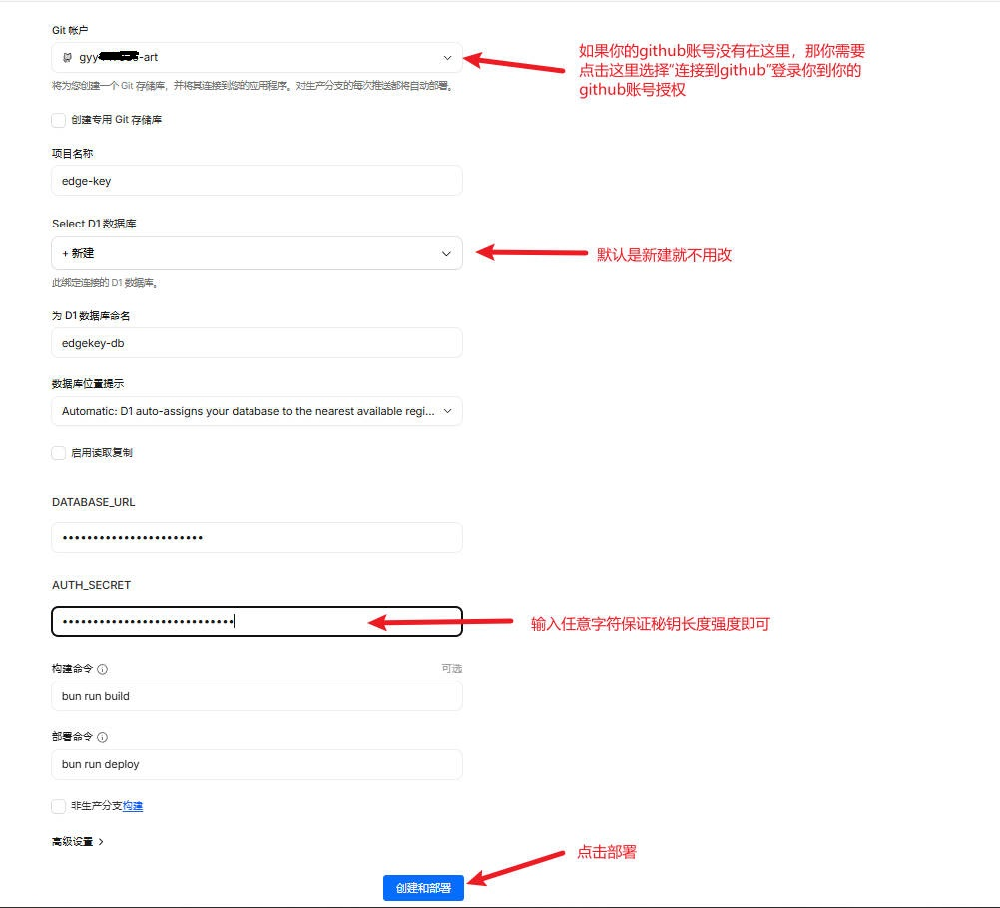
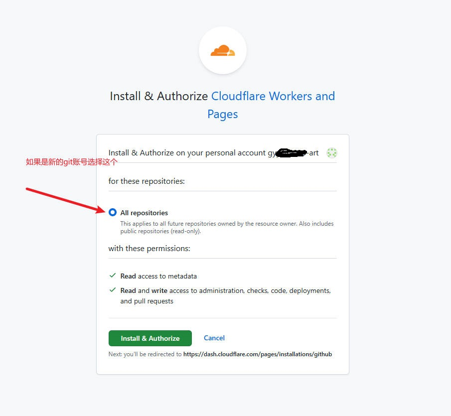
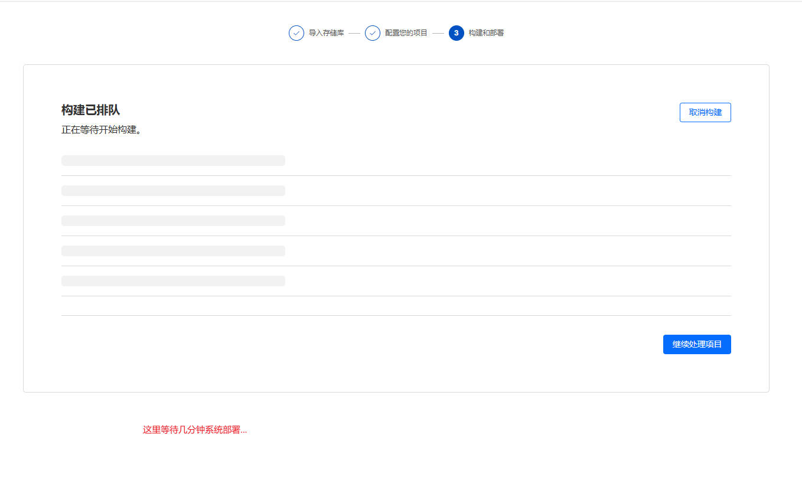
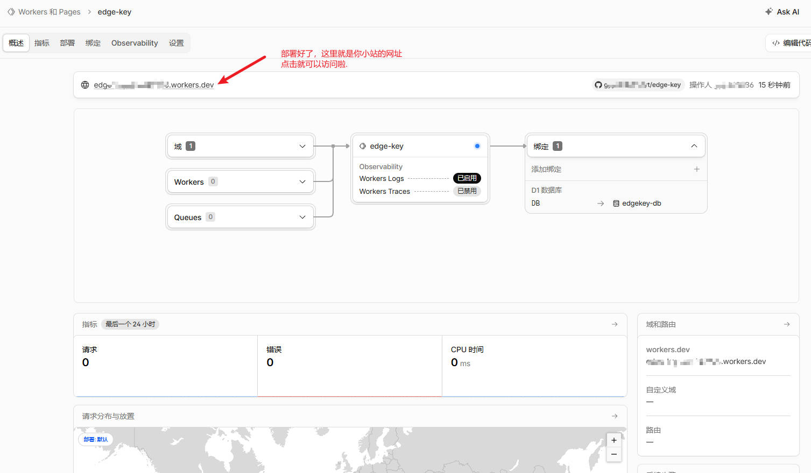

### 告别繁琐一键部署上线Cloudflare 实战！

EdgeKey这是专为“懒人”准备的发卡系统。 它可以运行 Cloudflare 上！ 不仅能实现 0 成本起步，还能享受全球加速和顶级DDOS防护，所有的这些点击就送（一键部署上线）

## 【3 分钟上手指南】

准备Cloudflare(https://dash.cloudflare.com/)、Github账号(https://github.com/)，先全部登录上去（没有账号的看后面注册教程）

- 打开GitHub仓库：https://github.com/34892002/edgeKey
- 找到 README 里的 Deploy to Cloudflare 蓝色按钮，点击！
- 按照提示登录你的 GitHub 和 CF 账号，设置一个秘钥。
- 完成！ 你的发卡站已经瞬间部署在全球几百个节点上了。

## 【图片教程】

在你的小站网址比如 edge-key.xxx.workers.dev 后面加上 /admin ，就是你的后台登录地址，假设我的小站地址是 edge-key.12345.workers.dev
那么登录地址就是edge-key.12345.workers.dev/admin，  输入用户名 admin，密码 admin123456 即可登录后台上架商品。

## 【注册教程】

[注册Cloudflare](https://www.bilibili.com/video/BV1aD1ZBYE8S/?spm_id_from=333.1369.0.0&vd_source=e9d2136ac8d942760fc931e49f0099d6)

[注册Github](https://www.bilibili.com/video/BV1JcjgznEuU/?spm_id_from=333.337.search-card.all.click&spm_id_from=333.1369.0.0&vd_source=e9d2136ac8d942760fc931e49f0099d6)

## 常见问题
如果 Cloudflare 提示【无法获取存储库内容】之类的异常，多半是之前绑定过github，但是授权实际上却是异常状态，解绑重新绑定授权即可。
