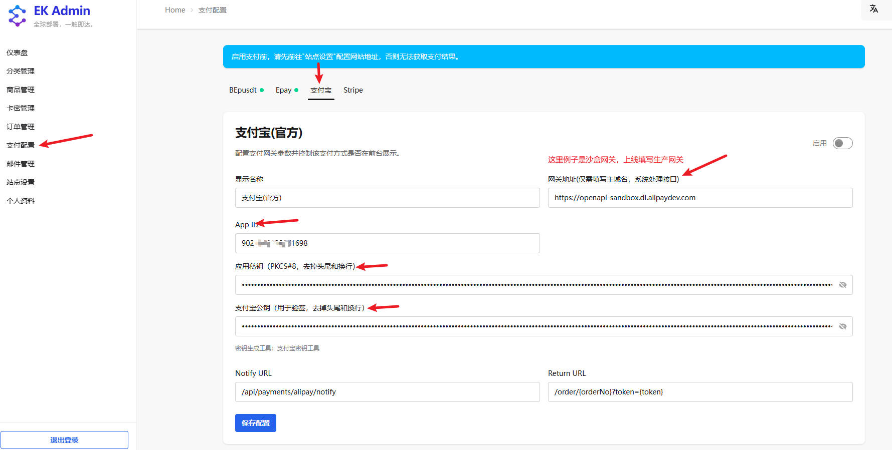

# EdgeKey 对接支付宝教程

**当前教程对接支付宝通过测试验收**

## 配置步骤

**配置说明**

- **网关地址**：填写支付宝开放平台生产网关地址 `https://openapi.alipay.com`，系统会自动拼接 API 路径（`/gateway.do`）。
- **支付宝应用 ID**：在支付宝开放平台获取的应用 App ID。
- **应用私钥**：支付宝开放平台生成的【应用私钥】（注意，去掉头尾的换行）。
- **支付宝公钥**：支付宝开放平台提供的【支付宝公钥】（注意，去掉头尾的换行）。

[支付宝官方文档-生成及配置密钥](https://opendocs.alipay.com/support/01raut)

**配置步骤示例**：
1. 登录 EdgeKey 管理后台
2. 进入「支付配置」页面
3. 选择支付宝标签页
4. 填写具体配置
5. 启用支付方式：点击右上角的启用开关
6. 保存配置：点击「保存配置」按钮

### 重要提示
填写完配置信息后，点击右上角的 **启用** 开关，然后点击 **保存配置** 按钮。
⚠️ **重要提示**：启用支付前，请先前往「站点设置」配置网站地址，否则无法获取支付结果。

## 配置字段说明

**通用字段说明**：
- **显示名称**：支付方式在前台显示的名称，用户可自定义
- **网关地址**：支付宝网关服务域名，系统会自动处理接口路径
- **Notify URL**：异步通知地址，支付完成后系统会回调此地址
- **Return URL**：同步回跳地址，用户支付完成后跳转的页面

**支付宝专用字段**：
- **支付宝应用 ID**：支付宝开放平台获取的应用 App ID
- **应用私钥**：支付宝开放平台生成的应用私钥（PKCS#8 格式）
- **支付宝公钥**：支付宝开放平台提供的公钥（用于验签）

## 异步通知地址和同步回跳地址

这两个地址的路由部分 **严格按要求填写**，只需将域名部分替换为您实际部署的 EdgeKey 服务器地址：

- **异步通知地址**：`/api/payments/alipay/notify`
    - 路由固定为 `/api/payments/alipay/notify`
    - 示例：若部署地址为 `https://example.com`，则填写 `/api/payments/alipay/notify`

- **同步回跳地址**：`/order/{orderNo}?token={token}`
    - 路由固定为 `/order/{orderNo}?token={token}`（`:orderNo` 和 `{token}` 为动态参数）
    - 示例：若部署地址为 `https://example.com`，则填写 `/order/{orderNo}?token={token}`

## 配置验证

配置完成后，请按照以下步骤进行测试：

1. 进入 EdgeKey 前台，选择一个商品进行购买。
2. 在结算页面选择支付宝支付方式。
3. 观察是否正常跳转到支付宝收银台页面。

## 故障排查

若出现网关错误提示，请按照以下步骤排查：

- **检查网络连通性**：确认 EdgeKey 服务器能够正常访问支付宝网关地址。
- **检查应用 ID 和密钥**：确认所配置的支付宝应用 ID 和密钥与支付宝开放平台中的一致。
- **检查回调地址**：确保异步通知地址可以从外部访问，且格式正确。
- **检查站点设置**：确保在「站点设置」中配置了正确的网站地址。
- **查看日志**：检查 EdgeKey 和支付宝的日志，获取更详细的错误信息。

## 支付宝工作模式

本项目使用 **标准支付模式**，根据订单的 `paymentChannel` 字段区分：
- `pc` → `alipay.trade.page.pay`（PC 网站支付）
- 其他 → `alipay.trade.wap.pay`（H5 手机支付）

## 相关链接

- [支付宝开放平台](https://open.alipay.com/)
- [支付宝 PC 支付文档](https://opendocs.alipay.com/open/270/105898)
- [支付宝 H5 支付文档](https://opendocs.alipay.com/open/203/107090)
- [支付宝密钥工具](https://opendocs.alipay.com/common/02kipl)
- [EdgeKey 项目主页](https://github.com/34892002/edgeKey)
