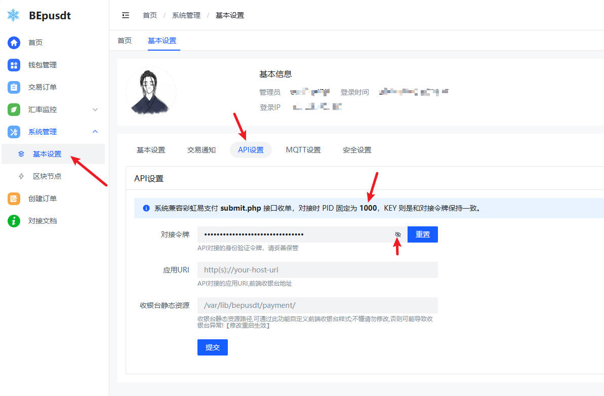
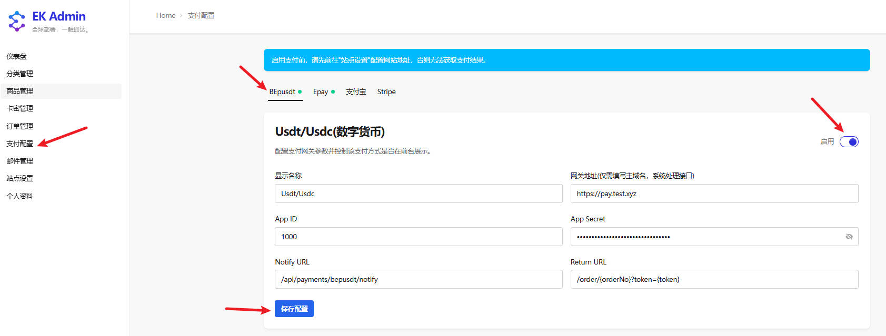
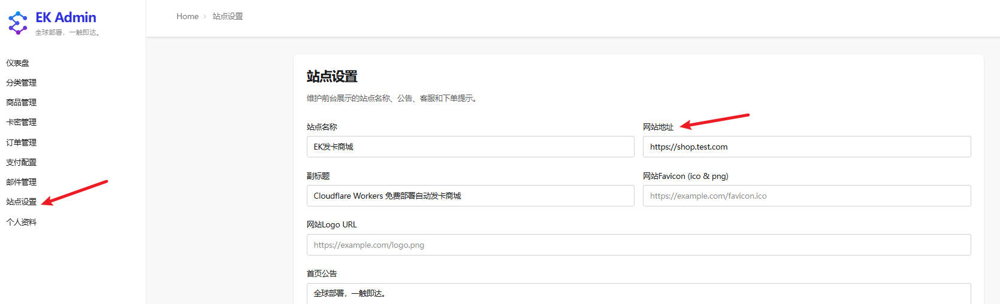

# EdgeKey 对接 BEpusdt 教程

**当前教程对接BEpusdt(v1.23.5)通过测试验收**

## 配置步骤

**配置说明**

- **网关地址**：只需填写域名，如 `https://test.shop.com`，系统会自动拼接 API 路径（`/api/v1/order/create-order`）。
- **App ID 和 App Secret**：在 BEpusdt 后台「系统管理 → 基本设置 → API 设置」中获取。
- **支付币种**：用户在 BEpusdt 收银台页面自由选择支付币种，具体在 BEpusdt 后台配置。

**配置步骤示例**：
1. 登录 EdgeKey 管理后台
2. 进入「支付配置」页面
3. 选择 BEpusdt 标签页
4. 填写具体配置
5. 启用支付方式：点击右上角的启用开关
6. 保存配置：点击「保存配置」按钮

### 重要提示
填写完配置信息后，点击右上角的 **启用** 开关，然后点击 **保存配置** 按钮。
⚠️ **重要提示**：启用支付前，请先前往「站点设置」配置网站地址，否则无法获取支付结果。

## 配置字段说明

**通用字段说明**：
- **显示名称**：支付方式在前台显示的名称，用户可自定义
- **网关地址**：支付网关服务域名，系统会自动处理接口路径
- **Notify URL**：异步通知地址，支付完成后系统会回调此地址
- **Return URL**：同步回跳地址，用户支付完成后跳转的页面

**BEpusdt专用字段**：
- **App ID**：BEpusdt后台获取的应用ID
- **App Secret**：BEpusdt后台获取的应用密钥（API密钥）

## 异步通知地址和同步回跳地址

这两个地址的路由部分 **严格按要求填写**，只需将域名部分替换为您实际部署的 EdgeKey 服务器地址：

- **异步通知地址**：`/api/payments/bepusdt/notify`
    - 路由固定为 `/api/payments/bepusdt/notify`
    - 示例：若部署地址为 `https://example.com`，则填写 `/api/payments/bepusdt/notify`

- **同步回跳地址**：`/order/{orderNo}?token={token}`
    - 路由固定为 `/order/{orderNo}?token={token}`（`:orderNo` 和 `{token}` 为动态参数）
    - 示例：若部署地址为 `https://example.com`，则填写 `/order/{orderNo}?token={token}`

## 配置验证

配置完成后，请按照以下步骤进行测试：

1. 进入 EdgeKey 前台，选择一个商品进行购买。
2. 在结算页面选择 BEpusdt 支付方式。
3. 观察是否正常跳转到收银台页面。

## 故障排查

若出现网关错误提示，请按照以下步骤排查：

- **检查网络连通性**：确认 EdgeKey 服务器能够正常访问 BEpusdt API 地址。
- **检查 App ID 和 App Secret**：确认所配置的 App ID 和 App Secret 与 BEpusdt 中的一致。
- **检查回调地址**：确保异步通知地址可以从外部访问，且格式正确。
- **检查站点设置**：确保在「站点设置」中配置了正确的网站地址。
- **查看日志**：检查 EdgeKey 和 BEpusdt 的应用日志，获取更详细的错误信息。

## BEpusdt 工作模式

本项目使用 **收银台模式**（`/api/v1/order/create-order`），用户在 BEpusdt 收银台页面自由选择支付链，无需在代码中指定 `trade_type`。

## 相关链接

- [BEpusdt 项目主页](https://github.com/v03413/bepusdt)
- [EdgeKey 项目主页](https://github.com/34892002/edgeKey)
