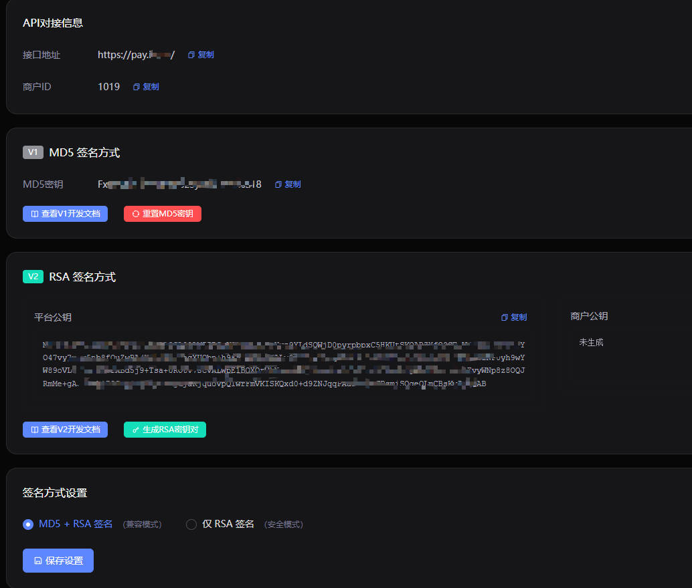
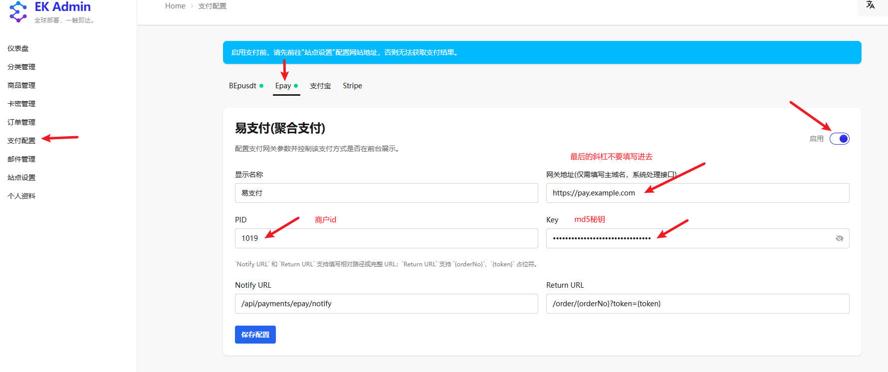

# EdgeKey 对接 Epay(易支付) 教程

**当前教程对接Epay(易支付)通过测试验收**

## 配置步骤

**配置说明**
易支付渠道众多后台有差异，但配置都差不多，需要只有 网关地址（一般就是渠道后台的网址）、商户ID、MD5秘钥 3个参数。
- **网关地址**：填写易支付平台提供的api接口信息，比如下面截图叫【接口地址】就是我们要找的(注意：斜杠不要，在edgeKey系统填写 https://pay.example.com即可)，系统会自动拼接 API 路径（`/submit.php`）。
- **PID 和 Key**：对接易支付的是v1接口，所以需要在易支付后台获取，如下图的【商户ID】和【MD5秘钥】。
- **支付渠道**：目前只支持支付宝和微信支付(type=alipay|wxpay)，不可配置。

**配置步骤示例**：
1. 登录 EdgeKey 管理后台
2. 进入「支付配置」页面
3. 选择 Epay 标签页
4. 填写具体配置
5. 启用支付方式：点击右上角的启用开关
6. 保存配置：点击「保存配置」按钮

### 重要提示
填写完配置信息后，点击右上角的 **启用** 开关，然后点击 **保存配置** 按钮。
⚠️ **重要提示**：启用支付前，请先前往「站点设置」配置网站地址，否则无法获取支付结果。

## 配置字段说明

**通用字段说明**：
- **显示名称**：支付方式在前台显示的名称，用户可自定义
- **网关地址**：支付网关服务域名，系统会自动处理接口路径
- **Notify URL**：异步通知地址，支付完成后系统会回调此地址
- **Return URL**：同步回跳地址，用户支付完成后跳转的页面

**Epay专用字段**：
- **PID**：易支付后台获取的商户ID（也称商户号）
- **Key**：易支付后台获取的商户密钥（也称API密钥）

## 异步通知地址和同步回跳地址

这两个地址的路由部分 **严格按要求填写**，只需将域名部分替换为您实际部署的 EdgeKey 服务器地址：

- **异步通知地址**：`/api/payments/epay/notify`
    - 路由固定为 `/api/payments/epay/notify`
    - 示例：若部署地址为 `https://example.com`，则填写 `/api/payments/epay/notify`

- **同步回跳地址**：`/order/{orderNo}?token={token}`
    - 路由固定为 `/order/{orderNo}?token={token}`（`:orderNo` 和 `{token}` 为动态参数）
    - 示例：若部署地址为 `https://example.com`，则填写 `/order/{orderNo}?token={token}`

## 配置验证

配置完成后，请按照以下步骤进行测试：

1. 进入 EdgeKey 前台，选择一个商品进行购买。
2. 在结算页面选择 Epay 支付方式。
3. 选择支付宝或微信支付渠道。
4. 观察是否正常跳转到支付页面。

## 故障排查

若出现网关错误提示，请按照以下步骤排查：

- **检查网络连通性**：确认 EdgeKey 服务器能够正常访问易支付平台地址。
- **检查 PID 和 Key**：确认所配置的 PID 和 Key 与易支付后台中的一致。
- **检查回调地址**：确保异步通知地址可以从外部访问，且格式正确。
- **检查站点设置**：确保在「站点设置」中配置了正确的网站地址。
- **查看日志**：检查 EdgeKey 和易支付平台的日志，获取更详细的错误信息。

## Epay 工作模式

本项目使用 **标准支付模式**（`/submit.php`），用户在前台选择支付渠道（支付宝或微信支付），系统会跳转到对应的支付页面。
