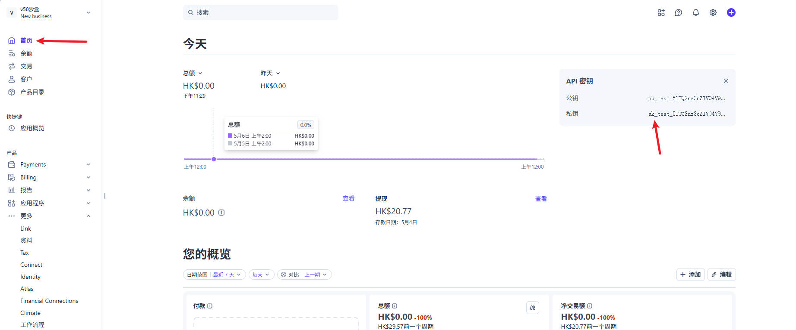
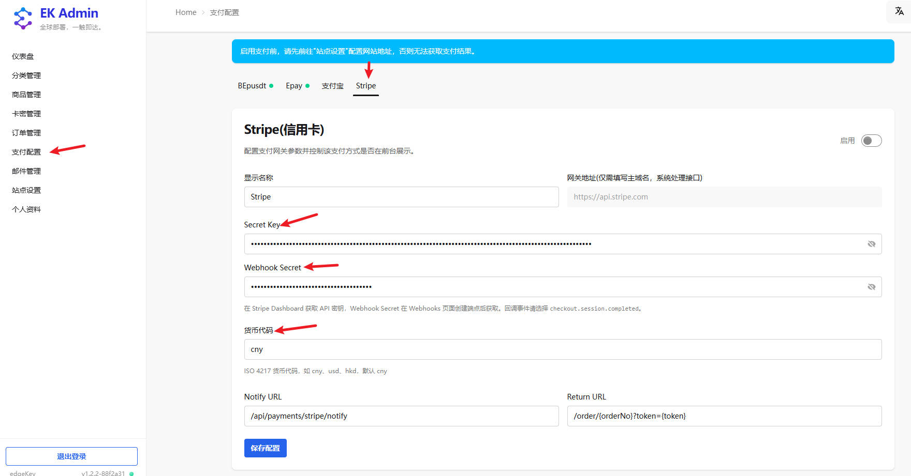
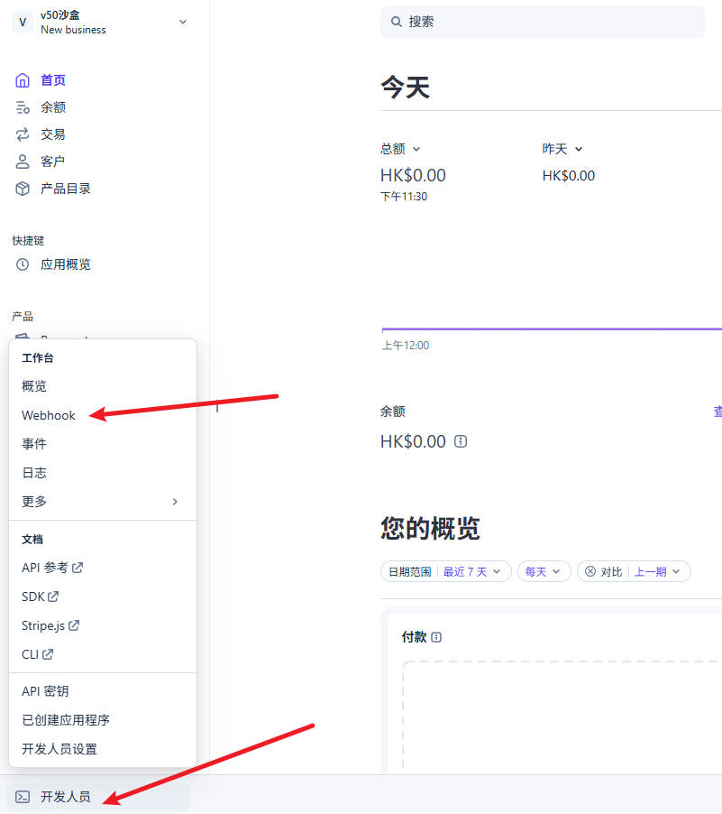
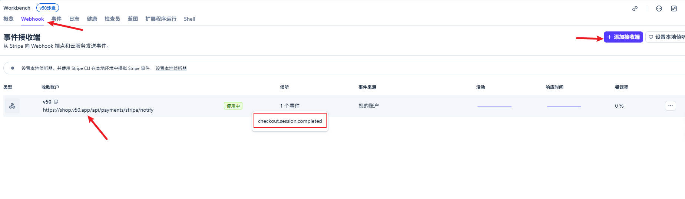
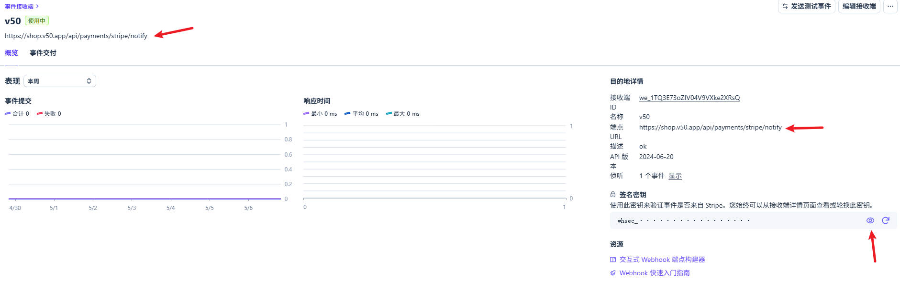

# EdgeKey 对接 Stripe 教程

**当前教程对接 Stripe 通过测试验收**

## 配置步骤

**配置说明**

- **网关地址**：Stripe API 网关地址，固定为 `https://api.stripe.com`（系统会自动处理）。
- **Stripe Secret Key**：在 Stripe Dashboard → Developers → API keys 中获取的 Secret key（`sk_live_...`）我这里是沙盒所以是sk_test_。
- **Stripe Webhook Secret**：在 Stripe Dashboard → Developers → Webhooks 中获取的端点签名密钥（`whsec_...`）。
- **货币代码**：ISO 4217 货币代码，如 `cny`、`usd`、`hkd`，默认 `cny`。
- **Webhook 配置**: Stripe需要自己配置回调，否则无法获取付款通知。跳转到 [Webhook配置与whsec获取](#webhook-配置)

**配置步骤示例**：
1. 登录 EdgeKey 管理后台
2. 进入「支付配置」页面
3. 选择 Stripe 标签页
4. 填写具体配置
5. 启用支付方式：点击右上角的启用开关
6. 保存配置：点击「保存配置」按钮

### 重要提示
填写完配置信息后，点击右上角的 **启用** 开关，然后点击 **保存配置** 按钮。
⚠️ **重要提示**：启用支付前，请先前往「站点设置」配置网站地址，否则无法获取支付结果。

## 配置字段说明

**通用字段说明**：
- **显示名称**：支付方式在前台显示的名称，用户可自定义
- **网关地址**：Stripe API 服务域名，系统会自动处理接口路径
- **Notify URL**：异步通知地址，支付完成后系统会回调此地址
- **Return URL**：同步回跳地址，用户支付完成后跳转的页面

**Stripe 专用字段**：
- **Stripe Secret Key**：Stripe Dashboard 获取的 Secret key（`sk_live_...`）
- **Stripe Webhook Secret**：Stripe Dashboard 获取的端点签名密钥（`whsec_...`）
- **货币代码**：ISO 4217 货币代码，如 `cny`、`usd`、`hkd`，默认 `cny`

## 异步通知地址和同步回跳地址

这两个地址的路由部分 **严格按要求填写**，只需将域名部分替换为您实际部署的 EdgeKey 服务器地址：

- **异步通知地址**：`/api/payments/stripe/notify`
    - 路由固定为 `/api/payments/stripe/notify`
    - 示例：若部署地址为 `https://example.com`，则填写 `/api/payments/stripe/notify`

- **同步回跳地址**：`/order/{orderNo}?token={token}`
    - 路由固定为 `/order/{orderNo}?token={token}`（`:orderNo` 和 `{token}` 为动态参数）
    - 示例：若部署地址为 `https://example.com`，则填写 `/order/{orderNo}?token={token}`

## 配置验证

配置完成后，请按照以下步骤进行测试：

1. 进入 EdgeKey 前台，选择一个商品进行购买。
2. 在结算页面选择 Stripe 支付方式。
3. 观察是否正常跳转到 Stripe 收银台页面。

## 故障排查

若出现网关错误提示，请按照以下步骤排查：

- **检查网络连通性**：确认 EdgeKey 服务器能够正常访问 Stripe API 地址。
- **检查 Secret Key 和 Webhook Secret**：确认所配置的 Stripe Secret Key 和 Webhook Secret 与 Stripe Dashboard 中的一致。
- **检查回调地址**：确保异步通知地址可以从外部访问，且格式正确。
- **检查站点设置**：确保在「站点设置」中配置了正确的网站地址。
- **查看日志**：检查 EdgeKey 和 Stripe 的日志，获取更详细的错误信息。

## Stripe 工作模式

本项目使用 **Checkout Session 模式**，用户跳转到 Stripe 托管收银台完成支付，支付完成后通过 Webhook 异步通知。

### Webhook 配置

在 Stripe Dashboard → Developers → Webhooks 创建端点：
- **URL**：`https://你的域名/api/payments/stripe/notify`
- **监听事件**：`checkout.session.completed`

> 注意这里【端点 URL】是你的域名 + (支付配置 -> Stripe) 里的 Notify URL。比如我的商店域名是https://shop.v50.app，Notify URL 是 /api/payments/stripe/notify，那么我的【端点 URL】就必须填 https://shop.v50.app/api/payments/stripe/notify

> 获取端点签名密钥（whsec_...）

### 签名验证（HMAC-SHA256）

1. 读取请求原始 body（不可解析后重新序列化）
2. 从 `Stripe-Signature` 请求头解析 `t`（时间戳）和 `v1`（签名）
3. 拼接签名字符串：`{t}.{rawBody}`
4. 用 `webhookSecret` 对拼接字符串做 HMAC-SHA256，结果转十六进制
5. 与 `v1` 比对，一致则验签通过

### 回调说明

回调为 JSON 格式，路由读取原始 body 后以 `__raw_body` 和 `__stripe_signature` 传入适配器。

| 字段 | 说明 |
|------|------|
| `type` | 事件类型，仅处理 `checkout.session.completed` |
| `data.object.id` | Stripe Session ID，作为 `paymentOrderNo` |
| `data.object.metadata.orderNo` | 商户订单号 |
| `data.object.amount_total` | 实际支付金额（单位：分） |

回调响应返回 `success` 字符串即可。

## 注意事项

- Stripe 要求订单金额折算成 USD 至少 $0.50（部分货币更高）。CNY 最低约 ¥4，低于此金额会报错。
- 支持零小数货币（如 JPY、KRW），这些货币金额无需乘以 100。

## 相关链接

- [Stripe Checkout 文档](https://stripe.com/docs/payments/checkout)
- [Stripe Webhook 文档](https://stripe.com/docs/webhooks)
- [Stripe API 密钥](https://dashboard.stripe.com/apikeys)
- [EdgeKey 项目主页](https://github.com/34892002/edgeKey)
